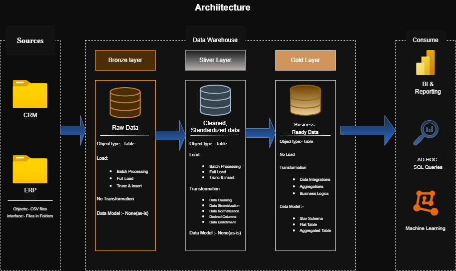
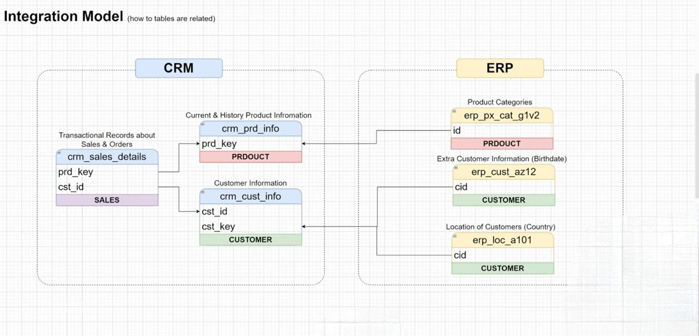
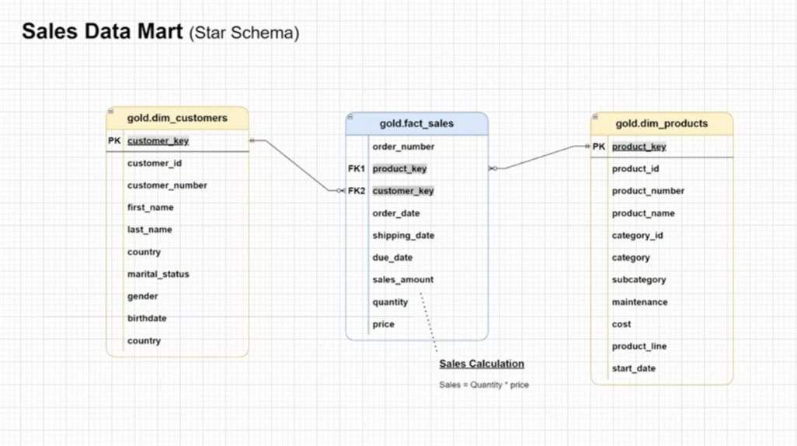

# 🏛️ SQL Data Warehouse Project

> A production-style Data Warehouse built with **SQL Server** using the **Medallion Architecture** (Bronze → Silver → Gold), integrating CRM and ERP source systems into an analytical Star Schema for sales insights.

---

## 🏗️ Data Architecture

This project follows the **Medallion Architecture** — a layered approach to progressively refine raw data into business-ready analytics.



| Layer | Purpose |
|---|---|
| 🥉 **Bronze** | Raw data ingested as-is from CRM and ERP CSV files |
| 🥈 **Silver** | Cleansed, standardized, and normalized data ready for integration |
| 🥇 **Gold** | Business-ready Star Schema (Fact + Dimension tables) for analytics |

---

## 📖 Project Overview

This project demonstrates end-to-end data engineering skills — from raw data ingestion to analytical reporting — across two source systems (CRM and ERP).

**What's built:**
- A multi-layer data warehouse in SQL Server
- ETL pipelines to extract, clean, and transform source data
- A Star Schema data model for the Sales domain
- SQL-based analytics for customer, product, and sales insights

---

## 🔗 Integration Model

The CRM and ERP systems share common entities (customers and products) that are linked via surrogate keys during the Silver-to-Gold transformation.



**Source Tables:**

| System | Table | Description |
|---|---|---|
| CRM | `crm_sales_details` | Transactional sales & order records |
| CRM | `crm_cust_info` | Customer information |
| CRM | `crm_prd_info` | Current & historical product information |
| ERP | `erp_cust_az12` | Extra customer data (birthdates) |
| ERP | `erp_loc_a101` | Customer location (country) |
| ERP | `erp_px_cat_g1v2` | Product categories |

---

## 🌟 Sales Data Mart — Star Schema

The Gold layer is modeled as a **Star Schema** to support fast, intuitive analytical queries.



**Tables:**
- `gold.fact_sales` — Order-level transactional fact table
- `gold.dim_customers` — Customer dimension (merged from CRM + ERP)
- `gold.dim_products` — Product dimension with category hierarchy

**Key Business Metric:**
```
Sales = Quantity × Price
```

---

## 📂 Repository Structure

```
sql-data-warehouse-project/
│
├── datasets/                        # Source CSV files (CRM & ERP raw data)
│
├── docs/                            # Architecture diagrams and documentation
│   ├── data_flow_diagram.png        # End-to-end data flow (Bronze → Silver → Gold)
│   ├── integration_model.png        # How CRM and ERP tables relate
│   ├── sales_data_mart.png          # Star Schema (Gold layer)
│   └── Data_Warehouse_Architecture.drawio  # Editable architecture file
│
├── scripts/
│   ├── bronze/                      # Scripts to load raw data from CSV
│   ├── silver/                      # Scripts for cleansing & transformation
│   └── gold/                        # Scripts for fact & dimension tables
│
├── README.md
└── LICENSE
```

---

## 🛠️ Tools & Technologies

| Tool | Purpose |
|---|---|
| **SQL Server Express** | Database engine |
| **SSMS** | Query & database management |
| **DrawIO** | Architecture & flow diagrams |
| **Git / GitHub** | Version control |

---

## 🚀 How to Run

1. **Clone the repo**
   ```bash
   git clone https://github.com/ChanakyaSreeHarshaG/SQl-Data_Warehouse_Project.git
   ```

2. **Set up the database** — Create a new database in SQL Server via SSMS

3. **Run Bronze scripts** — Load raw CSV data into Bronze layer tables

4. **Run Silver scripts** — Apply cleansing, deduplication, and standardization

5. **Run Gold scripts** — Build `fact_sales`, `dim_customers`, `dim_products`

6. **Run analytics queries** — Explore customer behavior, product performance, and sales trends

---

## 📊 Analytics Delivered

The Gold layer enables SQL-based reporting on:

- **Customer Behavior** — Purchase frequency, geography, demographics
- **Product Performance** — Revenue by category, subcategory, product line
- **Sales Trends** — Monthly trends, order volumes, revenue over time

---

## 🛡️ License

This project is licensed under the [MIT License](LICENSE).

---

## 🙋 About Me

## 🙋 About Me

Hi, I'm **Chandra Prakash Reddy Kotra**, a Computer Science Engineering graduate passionate about **Data Engineering, SQL, Data Warehousing, ETL Development, and Software Development**.

I enjoy building scalable data solutions, designing efficient ETL pipelines, and transforming raw data into meaningful business insights using SQL Server and the Medallion Architecture. I'm continuously learning and improving my skills through real-world projects.

Feel free to connect with me or explore my work:

* 🌐 **GitHub:** (https://github.com/Chandu20036)
* 💼 **LinkedIn:** (https://www.linkedin.com/in/kotra-chandra-prakash)
* 📧 **Email:** (chandraprakashreddykotra@gmail.com)

